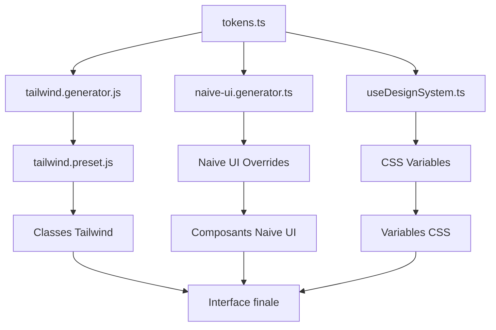

# 🎨 Système de Theming

## Vue d'ensemble

Notre système de theming est conçu pour offrir une expérience cohérente et flexible à travers toute l'application. Il utilise une architecture centralisée basée sur des tokens de design qui sont ensuite transformés en différents formats pour Tailwind CSS et Naive UI.

## Architecture



## Composants principaux

### 1. tokens.ts - Source unique de vérité

C'est le fichier central qui définit tous nos tokens de design :
- Couleurs (primaires, secondaires, etc.)
- Typographie
- Espacements
- Rayons de bordure
- Ombres
- Transitions

### 2. Générateurs

- **tailwind.generator.js** : Transforme les tokens en configuration Tailwind
- **naive-ui.generator.ts** : Crée les overrides pour Naive UI

### 3. useDesignSystem.ts

Composable principal qui :
- Gère l'état des thèmes
- Génère les configurations
- Injecte les variables CSS
- Persiste les préférences utilisateur

## Utilisation

### Dans un composant Vue

```vue
<template>
  <n-config-provider 
    :theme="naiveTheme" 
    :theme-overrides="naiveThemeOverrides"
  >
    <button class="btn-ds-primary">
      Mon bouton
    </button>
  </n-config-provider>
</template>

<script setup>
import { useDesignSystem } from '@/composables/useDesignSystem'

const { 
  naiveTheme, 
  naiveThemeOverrides, 
  setThemePreset 
} = useDesignSystem()
</script>
```

### Changer de thème

```typescript
// Changer le thème
setThemePreset('cyberpunk')

// Ou personnaliser les couleurs
updateCustomColors('dark', {
  primary: '#ff6b35',
  primaryHover: '#ff5722'
})
```

## Avantages

- ✅ Source unique de vérité pour tous les tokens
- ✅ Cohérence garantie entre Tailwind et Naive UI
- ✅ Support du mode sombre/clair
- ✅ Personnalisation facile
- ✅ Performance optimisée

## Bonnes pratiques

1. Toujours utiliser les tokens définis dans `tokens.ts`
2. Éviter les couleurs codées en dur dans les composants
3. Utiliser les classes Tailwind générées plutôt que des styles personnalisés
4. Préférer les composants Naive UI qui respectent automatiquement le thème